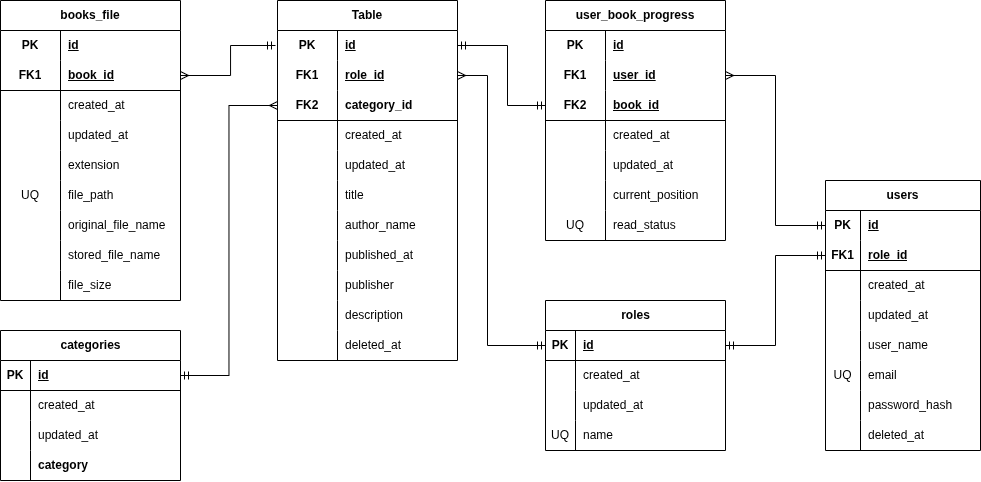

# データベース定義書

## テーブルの実装の順序について

本アプリケーションでは最小機能での開発を目指すこと。
及び、テーブル間の依存関係を考慮し、以下の順序で実装を行う。

### 第一群

MVPに必要な基盤テーブル。
ユーザー認証、書籍管理、閲覧権限、読書状態の管理に必要なため最初に実装する。

- ユーザーテーブル
- ロールテーブル
- 書籍テーブル
- カテゴリーテーブル
- 書籍ファイルテーブル
- 読書情報テーブル
- ロール別書籍閲覧権限テーブル

### 第二群

検索性・利便性を高めるための拡張機能用テーブル。
MVP完成後に順次実装する。

- タグテーブル
- 書籍タグテーブル
- ユーザーブックマークテーブル
- しおりテーブル
- ユーザーレビューテーブル
- 読書履歴テーブル
- 著者テーブル

### 第三群

共有機能や運用・監査用の補助テーブル。
基本機能の完成後に実装する。

- 共有URLテーブル
- アクセスログテーブル

## 各テーブルの概要

各テーブルの概要について、以下に説明する。
カラムの詳細については、後述するテーブル定義(スプレッドシート)を参照すること

### ユーザーテーブル

ユーザーの情報を管理するテーブル。
主にログインに用いる情報を管理する。

### ロールテーブル

ユーザーの権限種別を管理するテーブル。
管理者、一般ユーザーなどのロール情報を管理する。

### ロール別書籍閲覧権限テーブル

ロールごとに閲覧可能な書籍を管理するテーブル。
どのロールがどの書籍を閲覧できるかを管理する。

### 書籍テーブル

タイトル、著者名、出版社、出版日、説明、ページめくり方向、カテゴリなどの書籍メタデータを管理する。
著者情報はMVPでは著者名として保持し、著者テーブルでの管理は拡張機能として扱う。

ページめくり方向(page_turn_direction)は以下の値を使用する。

- ltr: 左から右へ読む
- rtl: 右から左へ読む

### 著者テーブル

書籍の著者の情報を管理するテーブル。
著者の名前やプロフィールなどを管理する。

※MVPでは著者情報は書籍テーブルの著者名として保持し、著者テーブルは拡張機能として実装する。

### 書籍ファイルテーブル

書籍に紐づくEPUB/PDFファイルの情報を管理するテーブル。
ファイルパス、拡張子、MIMEタイプ、元ファイル名、保存ファイル名、ファイルサイズを管理する。
1つの書籍に対して複数のファイルを紐づけられる。

### 読書情報テーブル

ユーザーごとの読書状態を管理するテーブル。
ユーザーと書籍の組み合わせごとに、現在位置と読書状態を保存する。
同一ユーザー・同一書籍の読書情報は1件のみ保持する。

read_status は以下の値を使用する。

- unread: 未読
- reading: 読書中
- completed: 読了

### タグテーブル

タグの情報を管理するテーブル。
タグの名前や説明などを管理する。

### 書籍タグテーブル

書籍とタグの関連を管理するテーブル。
どの書籍がどのタグに関連付けられているかを管理する。

### ユーザーブックマークテーブル

ユーザーのブックマーク情報を管理するテーブル。
どのユーザーがどの書籍をブックマークしているかを管理する。

### しおりテーブル

ユーザーのしおり情報を管理するテーブル。
どのユーザーがどの書籍のどのページにしおりを設定しているかを管理する。

### カテゴリーテーブル

書籍のカテゴリ情報を管理するテーブル。
書籍登録時に自由入力ではなく、定義済みカテゴリから選択できるようにする。
表示順や有効状態も管理する。

### ユーザーレビューテーブル

ユーザーのレビュー情報を管理するテーブル。
どのユーザーがどの書籍に対してどのようなレビューを投稿しているかを管理する。

### 読書履歴テーブル

ユーザーの読書履歴を管理するテーブル。
どのユーザーがどの書籍をいつ閲覧したかを管理する。

### 共有URLテーブル

共有URLの情報を管理するテーブル。
どの書籍がどのような共有URLを発行しているかを管理する。

### アクセスログテーブル

アクセスログの情報を管理するテーブル。
アプリのアクセス全般を管理する。

## テーブル定義

各テーブルのカラムの詳細については、以下のスプレッドシートを参照すること。
[スプレッドシート](https://docs.google.com/spreadsheets/d/1mGhdG7Sm_U5GOE5lkbBZ1jsISWYVOmdijbZrs_PLL7M/edit?gid=0#gid=0)

## リレーション概要

- ロール 1 : N ユーザー
- カテゴリー 1 : N 書籍
- 書籍 1 : N 書籍ファイル
- ユーザー 1 : N 読書情報
- 書籍 1 : N 読書情報
- ロール 1 : N ロール別書籍閲覧権限
- 書籍 1 : N ロール別書籍閲覧権限

読書情報テーブルは、ユーザーと書籍の組み合わせで一意とする。
ロール別書籍閲覧権限テーブルは、ロールと書籍の組み合わせで一意とする。

## 命名ルール

- テーブル名はスネークケースの複数形とする
- 主キーは id とする
- 外部キーは user_id, book_id のようにする
- 作成日時は created_at、更新日時は updated_at とする
- 論理削除のフラグは 日付型でdeleted_at とする
- Prismaのモデル名は PascalCase の単数形とする
- 実テーブル名は @@map を使用し、スネークケースの複数形とする

## ER図

